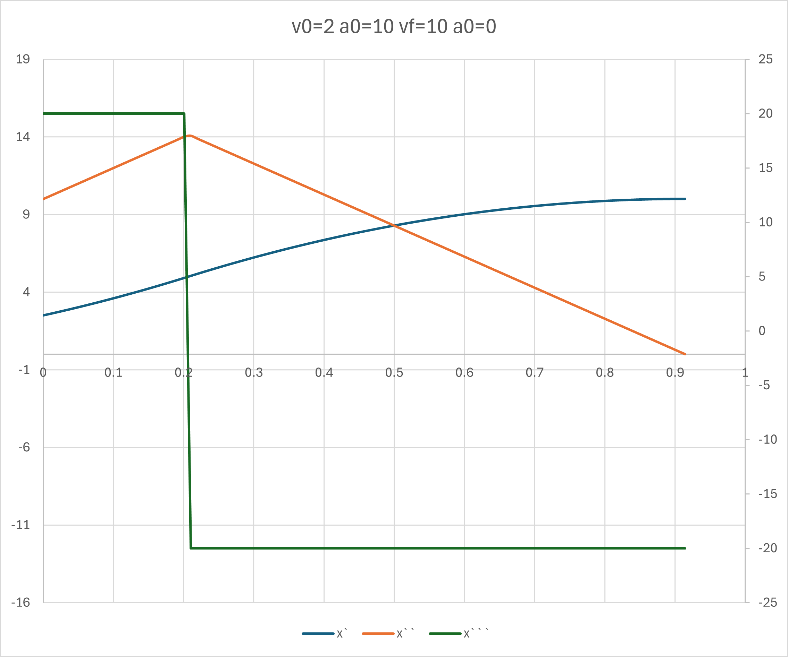
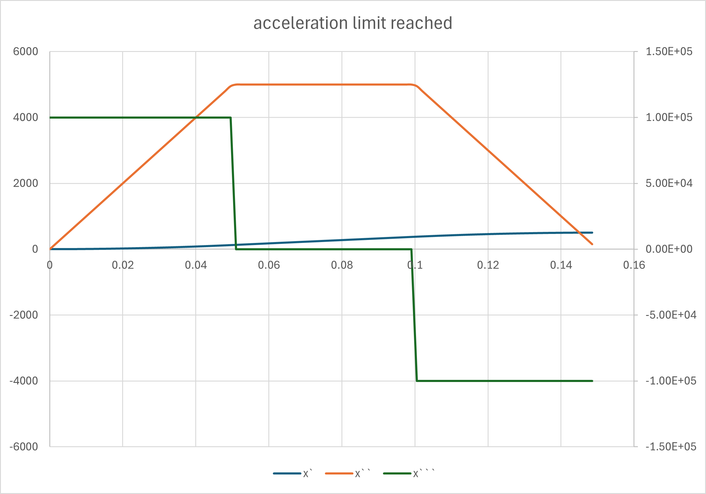

# Bang-Bang Jerk-Limited Trajectory Planning

Solves 1-D jerk-limited bang-bang trajectories with arbitrary
initial and final velocity and acceleration constraints.

```c++
// boundary conditions and limitations
double v0=30, a0=0.6;
double vf=0, af=0;
double jerk_max = 30; // mm/sec^3

BangBang bangBang;
bangBang.solveForMinTime(v0,a0, vf,af, jerk_max);
double t0 = 0;
double t1 = bangBang.switchTime();
double tf = bangBang.endTime();
// use for building a spline at the rest of your SW stack
spline_knots = {
    // position,                velocity,               delta time
    {bangBang.evaluate(t0,0),   bangBang.evaluate(t0,1), 0},
    {bangBang.evaluate(t1,0),   bangBang.evaluate(t1,1), t1},
    {bangBang.evaluate(tf,0),   bangBang.evaluate(tf,1), t2-t1},
};
```

> All solutions are analytic and do not rely on numerical integration or iterative solvers.

## Motivation

There are many libraries that calculate jerk limited motion profiles,
but I couldn't find what I needed: 

Given some velocity and acceleration boundary conditions, I needed to build the in-between trajectory. Since the boundary conditions aren't necessarily symmetric the trajectory also isn't necessarily symmetric.



In this image there are 2 sections:
1. From the initial state where `v0=2` and `a0=10`, using positive jerk the acceleration increases until the switching time.
2. The jerk becomes negative and the acceleration decreases until it reaches the final required value `af=10`, while the velocity reaches `vf=0`.

> This kind of trajectory is considered `c2` continuous, which means the position, velocity and acceleration are continuous.

In the next example there is a acceleration limited trajectory, which splits the trajectory to 3 sections:



1. Acceleration build up with positive jerk
2. Maintain acceleration at maximum allowed value
3. Acceleration ramp down with negative jerk till the final acceleration value is reached

> Note that this library doesn't respect a maximum speed limit.

I needed this data for using a motion controller **position-velocity-time** spline, which requires knowing the knots position, speed and delta time from the previous knot. The switching points are required for the motion controller to build the spline smoothly.


## Classes and Functions

`class BangBang` has 2 main construction functions:
- `solveForMinTime(v0, a0, vf, af, J)` - given maximum jerk, `J`, find the minimum time trajectory.
- `solveForMinJerk(v0, a0, vf, af, T)` - given known time span `T`, find the minimum needed jerk.

This class can return the value of the position, velocity, acceleration and jerk at any time along the path, using the method `double evaluate(double t, int deriv = 0)`.

It could also return the switching time and end time.

`class BangBangLimitedAccel` has only one construction function
- `solveForMinTime(v0, a0, vf, af, aMax, Jmax)`. 

In this class, if and when the acceleration reaches the maximum acceleration, the jerk is set to zero during the flat acceleration segment and the acceleration value is kept.

This class returns a number of switching times in case the acceleration limit is reached and there are 2 switching times.

---

## Examples and Unit Tests

In `BangBangTest.cpp` you can find multiple usage examples and edge-case tests.


